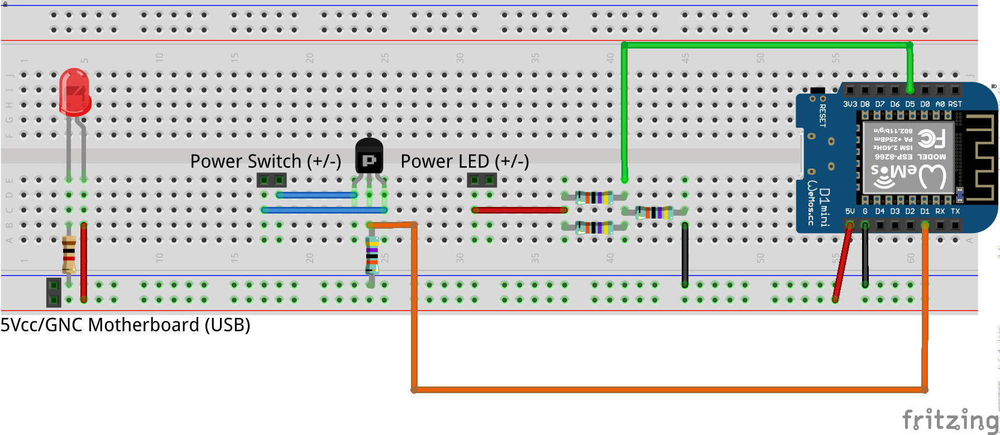

# ESP8266 MicroPython "PC Monitor" project

## Objectives

* Monitorize by hardware if the computer is ON, OFF or Sleeping (by reading the LED)
* Turn ON/OFF or force a shutdown remotely operating by hardware on the Power Switch

## The Hardware part

* ESP8266
* A transistor/MOSFET to press and release the computer Power Switch

## The Software part

* MicroPython
* MQTT

## Why not using Wake On LAN and a software solution?

* Because Wake On LAN works really bad on certain motherboards
* Because it can be more effective and reliable to turn on/off the computer by hardware and know it state by reading the Power LED

## Pinout

* Power Switch (OUTPUT): D1 (Warning, some pins change its state during bootup, like D3 or D4, which can cause the motherboard to turn on during microcontroller bootup)
* Power LED (INPUT): D5 (any valid digital GPIO with no on-board LED should work)

## Schematic

MOSFET Pinout: SOURCE, GATE, DRAIN

## TODO

* Identify computer status (ON/OFF/SLEEP) by the Power LED (OFF, ON, Blinking)
